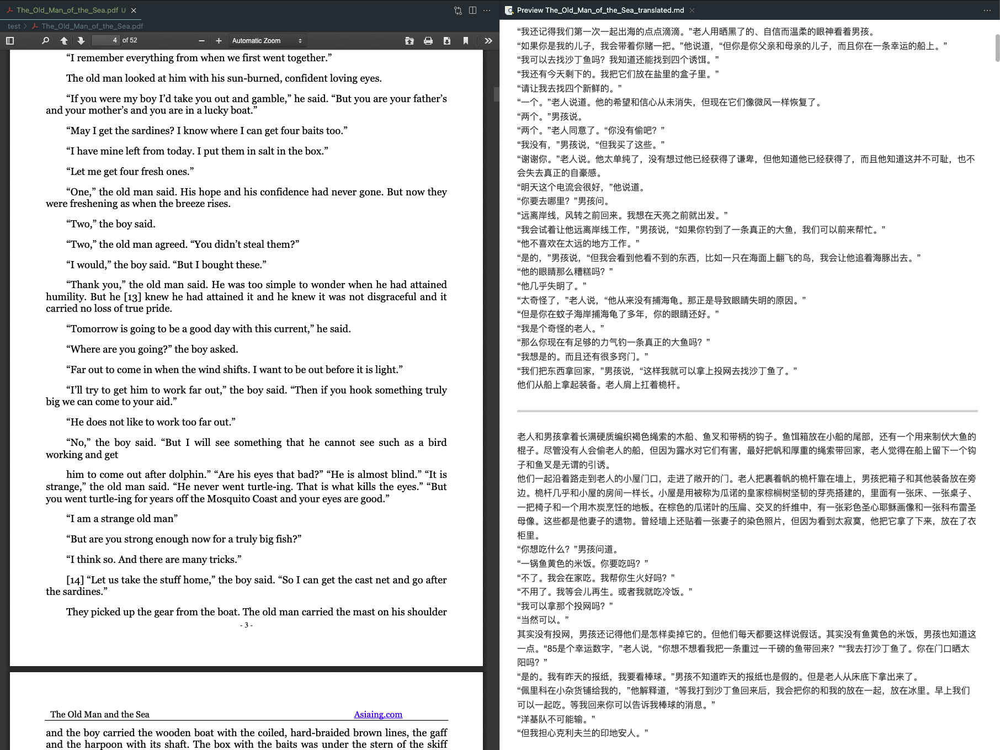

# OpenAI-Translator

<p align="center">
    <br> English | <a href="README-CN.md">中文</a>
</p>
<p align="center">
    <em>All the code and documentation are entirely generated by OpenAI's GPT-4 Model</em>
</p>


## Introduction

OpenAI Translator is an AI-powered translation tool designed to translate English PDF books to Chinese. The tool leverages large language models (LLMs) like ChatGLM and OpenAI's GPT-3 and GPT-3.5 Turbo for translation. It's built in Python and has a flexible, modular, and object-oriented design. 

## Why this project

In the current landscape, there's a lack of non-commercial yet efficient PDF translation tools. Many users have PDF documents with sensitive data that they prefer not to upload to public commercial service websites due to privacy concerns. This project was developed to address this gap, providing a solution for users who need to translate their PDFs while maintaining data privacy.

### Sample Results

The OpenAI Translator is still in its early stages of development, and I'm actively working on adding more features and improving its performance. We appreciate any feedback or contributions!



<p align="center">
    <em>"The Old Man and the Sea"</em>
</p>

## Features

- [X] Translation of English PDF books to Chinese using LLMs.
- [X] Support for both [ChatGLM](https://github.com/THUDM/ChatGLM-6B) and [OpenAI](https://platform.openai.com/docs/models) models.
- [X] Flexible configuration through a YAML file or command-line arguments.
- [X] Timeouts and error handling for robust translation operations.
- [X] Modular and object-oriented design for easy customization and extension.
- [X] Implement a graphical user interface (GUI) for easier use.
- [ ] Add support for batch processing of multiple PDF files.
- [X] Create a web service or API to enable usage in web applications.
- [X] Add support for other languages and translation directions.
- [ ] Add support for preserving the original layout and formatting of the source PDF.
- [ ] Improve translation quality by using custom-trained translation models.


## Getting Started

### Environment Setup

1.Clone the repository `git clone git@github.com:DjangoPeng/openai-translator.git`.

2.The `OpenAI-Translator` requires Python 3.6 or later. Install the dependencies with `pip install -r requirements.txt`.

3.Set up your OpenAI API key(`$OPENAI_API_KEY`) or ChatGLM Model URL(`$GLM_MODEL_URL`). You can either add it to your environment variables or specify it in the config.yaml file.

### Usage

You can start up OpenAI-Translator by providing command-line and use it by browser.


#### Using command-line

```bash
# Set your api_key as an env variable
export OPENAI_API_KEY="sk-xxx"
python ai_translator/http_server.py
```

#### Using browser

```
http://localhost:8000
```

## License

This project is licensed under the GPL-3.0 License. See the [LICENSE](LICENSE) file for details.
